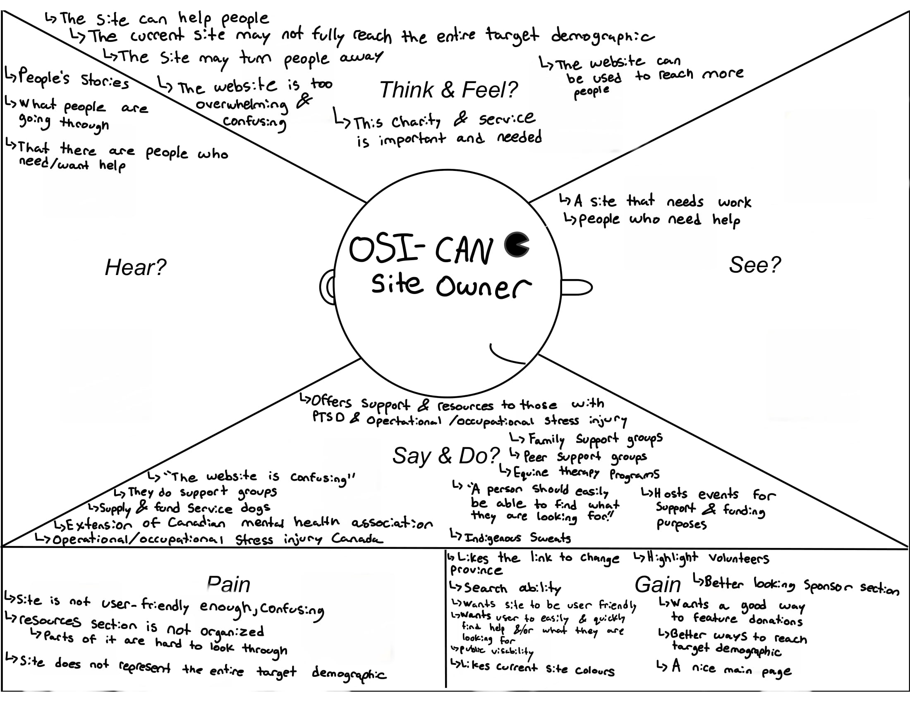
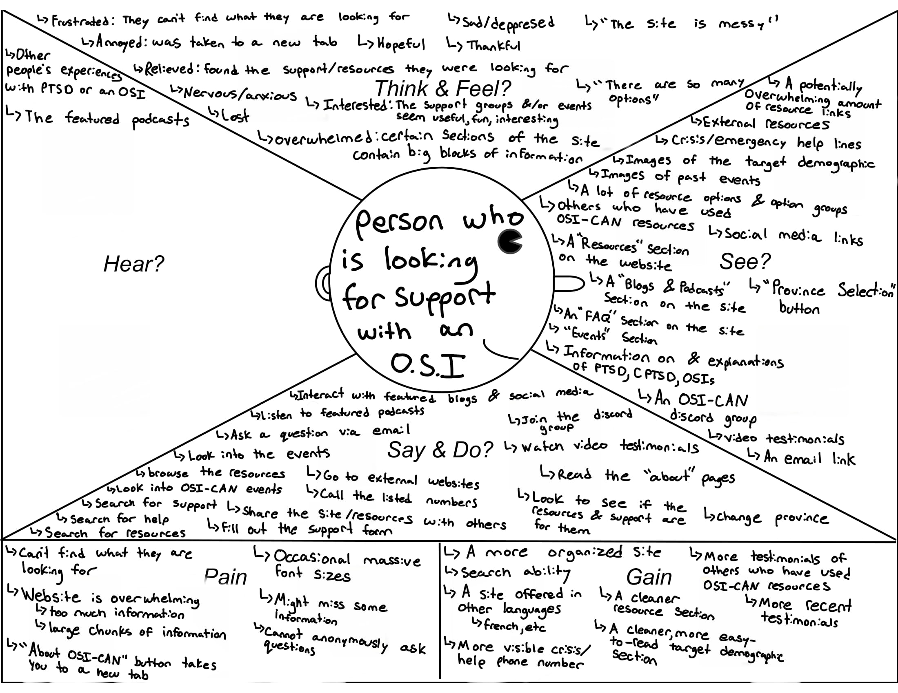
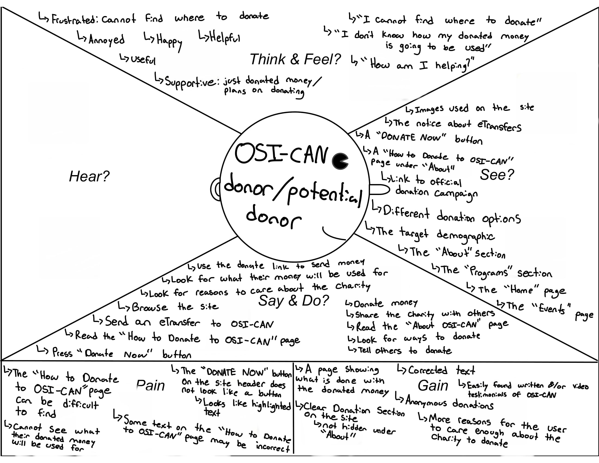
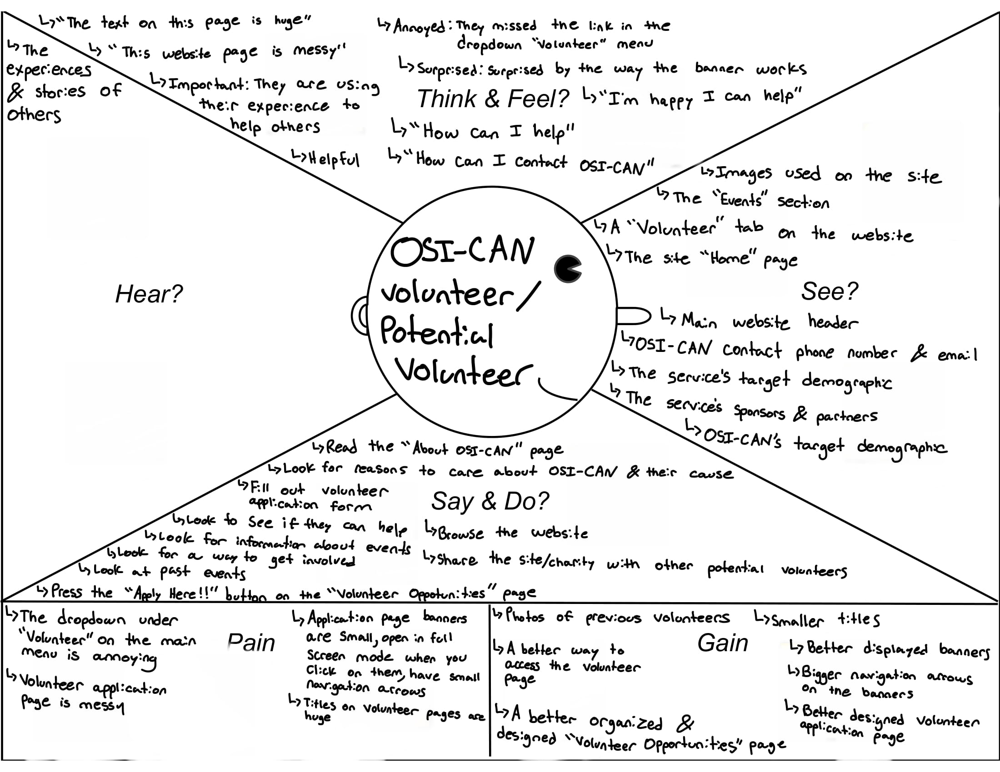

# Empathy Maps

## Table of Contents

- [Overview](#overview)
- [OSI-CAN Site Owner](#osi-can-site-owner)
- [Person Seeking Support](#person-seeking-support)
- [Donor / Potential Donor](#donor--potential-donor)
- [Volunteer / Potential Volunteer](#volunteer--potential-volunteer)
- [Download PDF](#download-pdf)
- [Back to Main](#back-to-main)

---

## Overview

Empathy Maps were created to better understand different types of users who interact with OSI-CAN.  
These maps help capture what users **see, hear, think & feel, say & do, their pains, and their gains**.

---

## OSI-CAN Site Owner

---

## Person Seeking Support

---

## Donor / Potential Donor

---

## Volunteer / Potential Volunteer

---

## Download PDF

  

---

## Back to Main

  

