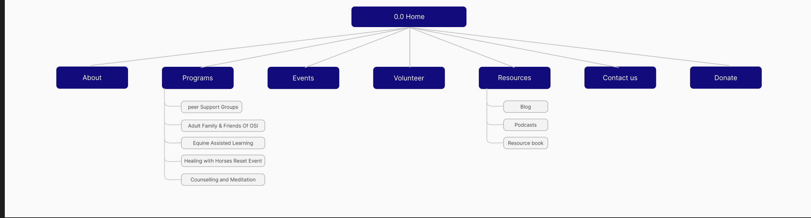
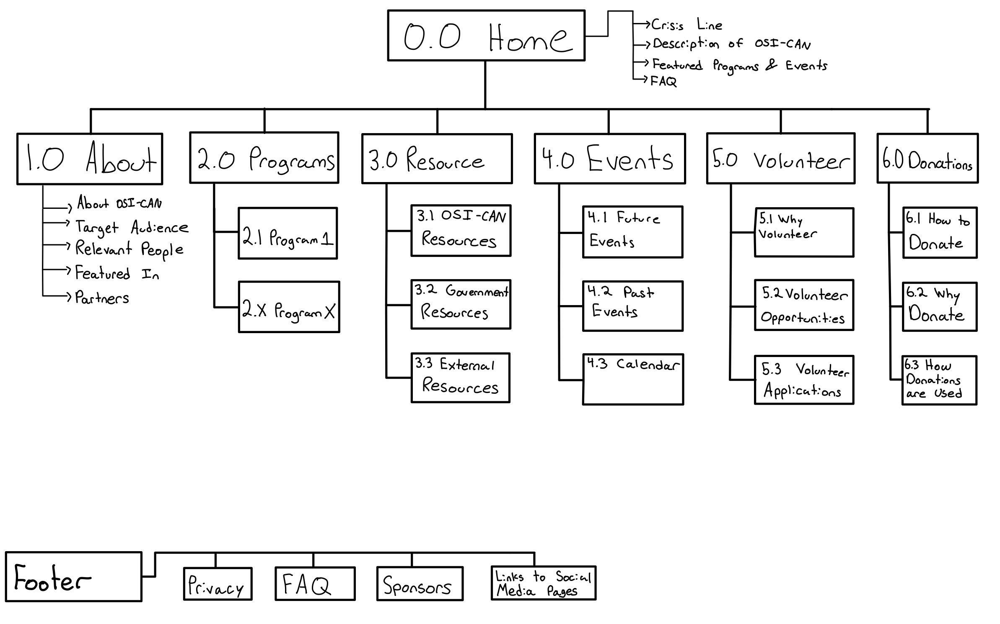
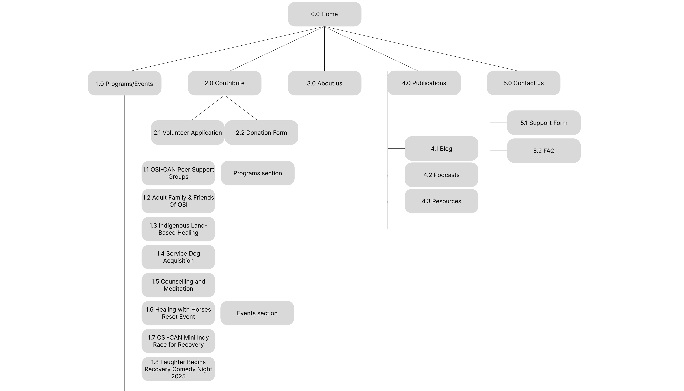
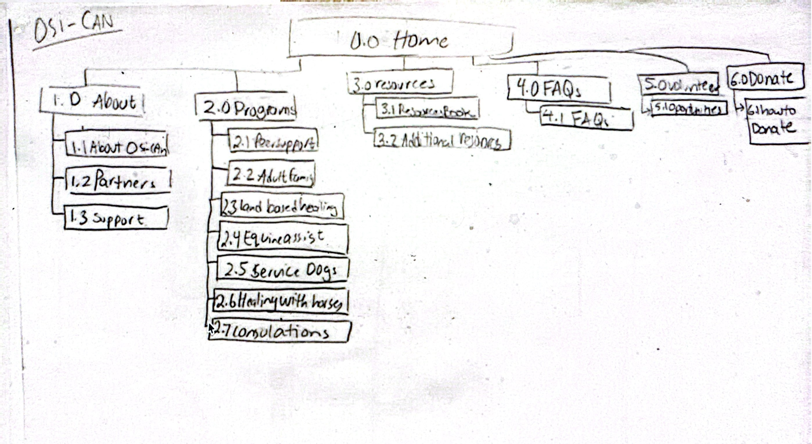

# Prototypes

## Table of Contents

- [Overview](#overview)
- [Team Members](#team-members)
  - [Parsa Mozouni](#parsa-mozouni)
  - [Bushra Alkhateeb](#bushra-alkhateeb)
  - [Abrianna Primavera](#abrianna-primavera)
  - [Chimeremeze Richmond](#chimeremeze-richmond)
- [Back to Main](../README.md)

---

## Overview

Our site map is simpler, clearer, and more user-focused. It groups pages logically, reduces clutter, and highlights key content like support, donations, and volunteering. This makes navigation faster, improves discoverability, and ensures users can reach important information with fewer clicks.

---

## Team Members

### Parsa Mozouni

---

### Abrianna Primavera

---

### Chimeremeze Richmond

---

### Bushra Alkhateeb

**Prototypes:**  

---

## Back to Main

  <a href="../README.md">
    

