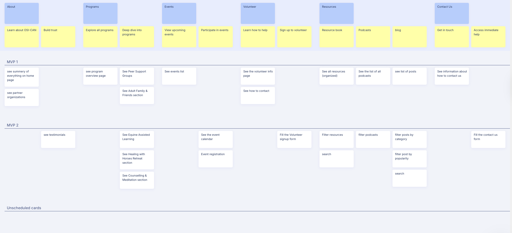

# User Story Map (USM)

## Overview

This document provides a **User Story Map (USM)** for our project.  
The map shows how features are grouped into **activities** (broad categories), **goals** (user needs), and **MVP releases** (priorities across phases).  
It helps the team align on the product journey and plan incremental releases.

---

## Story Map (Visual)

---

## Layout

- **Activities** → High-level categories
- **Goals** → User objectives under each activity
- **MVP 1** → First release with the most essential stories
- **MVP 2** → Second release with additional and enhanced stories

---

## Navigation

  
  

